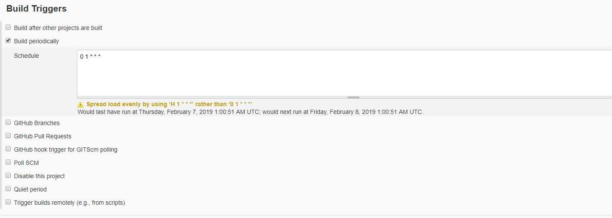

# Content
1. [Getting the Source Code](#1-getting-the-source-code- )
2. [Setup and Configure Jenkins](#2-setup-and-configure-jenkins- )
3. [Setup and Configure Jfrog](#3-setup-and-configure-jfrog- )
4. [Setup and Configure SonarQube](#4-setup-and-configure-sonarqube- )
5. [Setup and Configure Docker Registry](#5-setup-and-configure-docker-registry- )
6. [Installing External Dependencies](#6-installing-external-dependencies- )
7. [Configuring MOSIP](#7-configuring-mosip- )
8. [MOSIP Deployment](#8-mosip-deployment- )

***
## 1. Getting the Source Code [**[↑]**](#content)
MOSIP source code can be obtained via creating a fork of MOSIP Github repository from the URL [https://github.com/mosip/mosip/](https://github.com/mosip/mosip/). To know more about how to fork code from Github follow this [guide](https://help.github.com/articles/fork-a-repo/).
Once Forked, start the process of setting up your CI/CD tools to build and run MOSIP.

***
## 2. Setup and Configure Jenkins [**[↑]**](#content)
In this step, we will setup jenkins and configure it. Configuration contains steps like creating credentials, creating pipelines using xml files present in MOSIP source code, connecting Jenkins to recently forked repository and creating webhooks. Lets look at these steps one by one - 

### A. Installing Jenkins
Jenkins installation is pretty standard one(see [How to install Jenkins](https://jenkins.io/doc/book/installing/)), but to use MOSIP supported build pipelines you have to install Jenkins in an Redhat 7.5 environment. Also you have to install following list of plugins - 
* [Github Plugin](https://wiki.jenkins.io/display/JENKINS/GitHub+Plugin)
* [Artifactory Plugin](https://wiki.jenkins.io/display/JENKINS/Artifactory+Plugin)
* [Credentials Plugin](https://wiki.jenkins.io/display/JENKINS/Credentials+Plugin)
* [Docker Pipeline Plugin](https://wiki.jenkins.io/display/JENKINS/Docker+Pipeline+Plugin)
* [Email Extension Plugin](https://wiki.jenkins-ci.org/display/JENKINS/Email-ext+plugin)
* [Pipeline Plugin](https://wiki.jenkins-ci.org/display/JENKINS/Pipeline+Plugin)
* [Publish Over SSH Plugin](http://wiki.jenkins-ci.org/display/JENKINS/Publish+Over+SSH+Plugin)
* [SonarQube Scanner for Jenkins Plugin](https://docs.sonarqube.org/display/SCAN/Analyzing+with+SonarQube+Scanner+for+Jenkins)
* [SSH Agent Plugin](http://wiki.jenkins-ci.org/display/JENKINS/SSH+Agent+Plugin)
* [SSH Credentials Plugin](https://wiki.jenkins-ci.org/display/JENKINS/SSH+Credentials+Plugin)

### B. Create Pipelines
Next step after Jenkins installation is to configure/create Jenkins Jobs. These Jenkins Jobs are written as Jenkins Pipelines and respective Jenkinsfile in the MOSIP Source Code. MOSIP currently have 5 Jenkins job that take care of CI/CD process for Development Environment. There are - 

* master-branch-build-all-modules

    This Job is used to build whole MOSIP as a single unit. This Job is also acts as a nightly process to check the build status of MOSIP code in Master Branch. To create this Job you need to create a new Item in Jenkins as a Pipeline Project. Here are the configuration for Pipeline you might have to explictly change to use MOSIP provided Jenkinsfile- 

    

    

    As it can be seen from the above image that this pipeline usages Jenkinsfile present in master branch of MOSIP repository. Also you need to provide the Github credentials that this pipeline will take to connect and download this Jenkinsfile at the time of the build. Now let us look into this Jenkinsfile. 

    Jenkinsfile for this pipeline is written in Groovy Language using scripted style of writing code. 

* Kernel
* Pre-Registration
* Registration
* Registration-Processor
* Authentication

### C. Setting Up Github with Jenkins

***
## 3. Setup and Configure Jfrog [**[↑]**](#content)

***
## 4. Setup and Configure SonarQube [**[↑]**](#content)

***
## 5. Setup and Configure Docker Registry [**[↑]**](#content)

***
## 6. Installing External Dependencies [**[↑]**](#content)

***
## 7. Configuring MOSIP [**[↑]**](#content)

***
## 8. MOSIP Deployment [**[↑]**](#content)

***