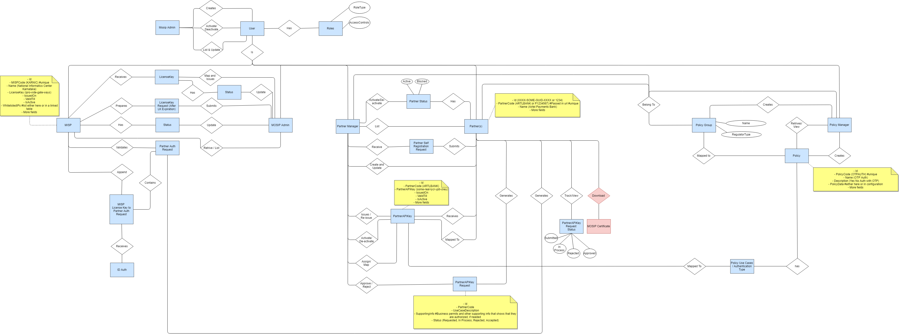
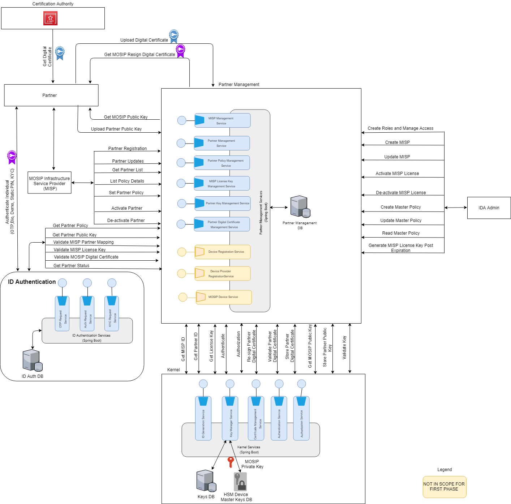

## Partner Management
Partner Management provides services for Partner and MISP (MOSIP Infrastructure Service Provider) Registration and Authentication. Registered Partners and MISP are only allowed to access MOSIP Authentication services. Partners and MISP are registered using Partner Management Services.  Authentication services of MOSIP will internally use the Partner Management Services to authenticate Partner and MISP and validate if only the registered entities are accessing the services.

Partner Management also involves policy management for Partners. Each partner can access Authentication services only based on a defined policy. Authentication services of MOSIP will internally use the Partner Management Services to authenticate a partner based on the policy.

Partner Management also includes License Key Management services. Authentication Services of MOSIP will utilize Partner Management services for License key based authentication of a MISP Partners send authentication request and receive authentication responses in a secured setup. Public/Private keys are used for encryption/decryption/signing the request/response. Distribution of Public key to Partners and retrieval of Public key from partners is managed by Partner Management Services. 

Partners will utilize MOSIP’s resigned digital certificate from Partner Management Services for signing the authentication request.

## Partner Management Process Flow
Please refer to the [**process flow**](Process-view#id-authentication) of Partner Management

## Architecturally Significant Use Cases
**User Management**
* MOSIP admin would be able to create and manage(update,view) Partner Management users viz- MISP, Partner Manager, Policy Manager. Role authorization and access control for these users would be done at Kernel's Identity and Access Management (IAM) module
* MOSIP admin would be able to issue and map license key to MISP. MOSIP admin would be able to list MISPs and would be able to activate/de-activate MISP, as well as MISP license key for a particular MISP
* MOSIP admin would be able to map users (Policy Manager, Partner Manager) to specific policy group. (Policy groups are country specific, that are customize and seeded from backend)
* MOSIP admin would be able to activate/de-activate policy manager,partner manager

**MOSIP Infrastructure Service Provider (MISP)**
* MISP will be managing whitelisted IPs at infrastructure security level and every authentication request is intercepted by MISP for validation of request from authorized partners. MISP will append MISP license key with every partner authentication request, that would be taken care at proxy/gateway infrastructure level
* MISP will receive license key from Partner Management module. MISP would be able to generate new license key request and receive new license key after expiration of existing license key
* MISP would be able to generate usage statistics report for billing purpose (out of scope for first release)

**Policy Manager**
* Policy manager would be able to create policy for the policy group he belongs to
* Policy manager would be able to activate and de-activate policy for his policy group. All associated PartnerAPIKeys for the policy would accordingly get impacted
* Policy manager would be able to update policy for his policy group. All associated PartnerAPIKeys for the policy would accordingly get impacted
* Policy manager would be able to list all policies for his policy group

**Partner Manager**
*  Partner manager would be able to list all partners for a policy group
*  Partner manager would be able to activate/de-activate partners
*  Partner manager would be able to approve / reject PartnerAPIKey request, as received from partner
*  Partner manager would be able to issue PartnerAPIKey(s) to a specified partner for fulfilling specified use case(s) as requested in PartnerAPIKey request 
*  Partner manager would be able to map PartnerAPIKey(s) to a specified partner
*  Partner manager would be able to map PartnerAPIKey(s) to policy
*  Partner Manager would be able to retrieve and update partner details for a specific PartnerAPIKey
*  Partner manager would be able to issue new PartnerAPIKey(s) after expiration of existing PartnerAPIKey(s), and map the same to the partner
*  Partner manager would be able to activate/de-activate PartnerAPIKey for a partner

**Partners**
*  Partners would be able to do self registration in partner management module. Post successful registration, partners would be provided login credentials for further activities
*  Using login credentials, Partners would be able to submit PartnerAPIKey request, track PartnerAPIKey request status, download PartnerAPIKey
*  Partners would be able to download MOSIP signed digital certificate for signing request. Partner management would be able to validate validity of digital certificate
*  Partners would be able to encrypt any request using MOSIP provided public key. Partner management module would be able to decrypt the request, using MOSIP secured private key
*  Partners would be able to upload partner public keys to partner management module. Any response to partners would be encrypted using respective partner public keys

**ID Authentication Services**
* IDA would be able to validate digital certificate for all requests as received from partner, and would be able to decrypt all request using MOSIP secured private key
* IDA would be able to download partner public keys from Partner Management module. IDA would be able to encrypt every response for partner using respective partner provided public keys
* IDA would be able to validate PartnerAPIKey, as received from partner authentication request
* IDA would be able to validate MISP License Key, as received from partner authentication request
* IDA would be able to get partner policy details, post successful validation

## High Level Entity Relationships

## Logical View

