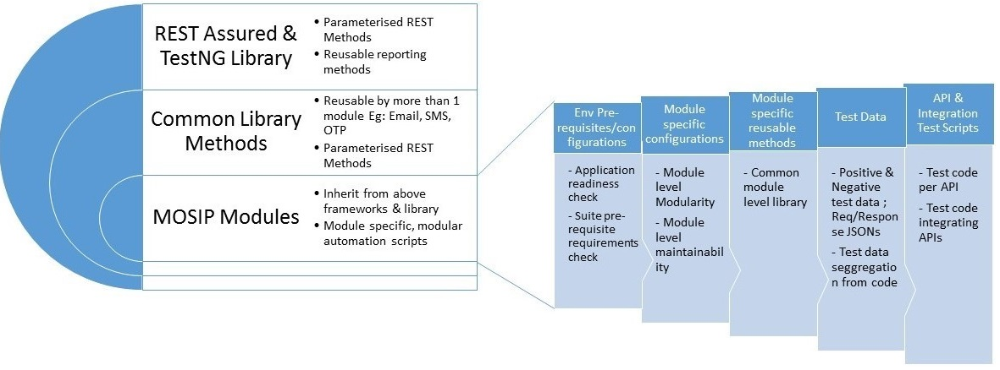
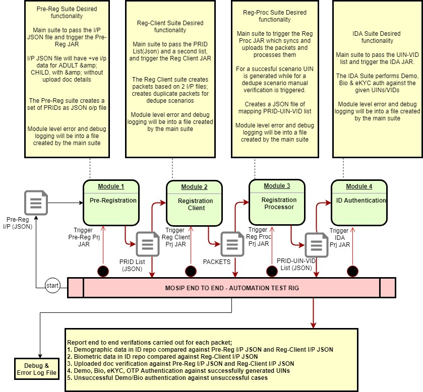

## Table Of Content
* [Test Rig Definition](#test-rig-definition)
* [Test Automation](#test-automation-)
  * [Module Level Automation Suites](#module-level-automation-suites-)
  * [System Level or E2E Automation Suite (Test Rig)](#system-level-or-e2e-automation-suite-test-rig-)

## Test Rig Definition
Test Rig represents a one click automation to build, deploy and test a software module. Successful execution of test rig would ascertain complete setup of the MOSIP platform.

Test-Rig comprises of multiple components starting from: 
1. Kubernetes env setup
1. Pulling the source code from the GIT repository
1. Running sonarqube tests for static code analysis
1. Building the application using maven
1. Automated application deployment using Kubernetes
1. Running automated unit tests
1. Running automated tests to verify and validate the application build against the given requirements. 

## Test Automation [**[↑]**](#table-of-content)
MOSIP platform architecture is mainly based on Micro services and SEDA architecture. 
Therefore it predominantly comprises of Rest & JAVA APIs. Therefore test automation best serves the purpose of detailed API level testing.
Test automation is the key to the successful testing of individual APIs and their interrelation with interdependent APIs. It ensures comprehensive test coverage and test data.

Automation deliverables mainly comprises of individual module level suites for the individual MOSIP modules:
1. Pre-Registration 
1. Registration Client
1. Registration Processor
1. IDA
1. Kernel

Additionally there will be an end to end, system level test suite that will cut across all modules covering the functionality 

### Module Level Automation Suites [**[↑]**](#table-of-content)

The below diagram depicts the various building blocks of the module level suite.

**Salient features** 
1. The automation suite is configurable to selectively execute tests such as Sanity or/and Regression 
2. Each module level suite covers API and inter API automation

The individual module level test suites and the end to end suite are triggered via the CI/CD pipeline and run post application deployment

1. [**Kernel Test Automation Suite - User Guide**]()
1. Pre-Registration Test Automation Suite - User Guide
1. Registration Client Test Automation Suite - User Guide
1. Registration Processor Test Automation Suite - User Guide
1. ID Authentication (IDA) Test Automation Suite - User Guide

### System Level or E2E Automation Suite (Test Rig) [**[↑]**](#table-of-content)

End to end system level Test Rig covers the functionality across the modules starting with Pre-Registration and ending in Registration Processor or IDA. 

The below diagram depicts the overall design of the end to end suite.

### 
 **Figure 2: _E2E Test Rig Design_**