**MOSIP - Test Strategy (Work in progress copy)**

file:///C:/Users/m9011150/AppData/Local/Temp/custom-emailable-report.html

Test Automation
Generic Test Automation Design - API Testing

# 1. Kernel Test Automation Suite - User Guide

## 1.1 About the Kernel Module

A critical interface module of MOSIP, Kernel is the core package on which MOSIP services are built upon and is a platform, which provides higher-level services and functions that shall be reused by other modules of MOSIP. 

Kernel provides a foundation to build and run the services by providing several significant necessary technical functions. Kernel makes it easy to build the higher-level services (domain services, batch services and core services) by taking care of fundamental features so that individual services are concerned with specific business functions. Kernel provides an active framework that ensures structure and rules within which the higher-level services operate.

Kernel automation works with Restful and Java API’s.


The test execution module of the Kernel module involving API’s is as depicted below
 
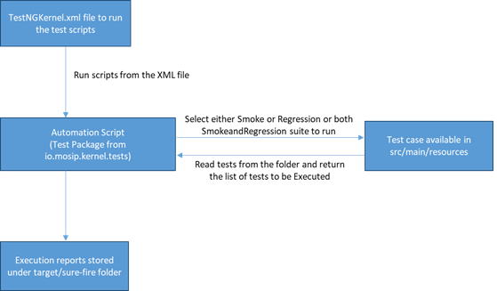 


## 1.2 Pre-requisites for understanding Java API automation
* Knowledge on Java 8
* Basic knowledge on Rest assured tool
* Knowledge on Maven 
* Knowledge on TestNg framework
* Knowledge on GitHub
* Good analytical and debugging skill

## 1.3 Procedure to check out the test code from the repository
* Create a workspace in the local system
* Open git bash in the workspace
* Enter the command :- git clone [link](/mosip/mosip.git)
* MOSIP project shall be cloned
* Import the “automationtests” project into the eclipse.
 
## 1.4 Pre-configuration information prior to test run
None

## 1.5 Procedure to Add new test cases into the API test suite
1. From the automationtests project, the test suites and cases can be located in the folder [**src/test/resources**]
1. Every API tests structure (model, api name and test case) are stored in a folder/sub-folder approach. Let us take an example of “**Email Notification service**” and explain how to add a new test

 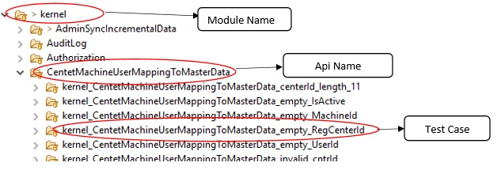 

3. Every test case will have 2 json files named [**request.json** and **response.json**] in its sub-folder as shown below

  

4. In the request.json file, we need to mention the input that needs to be send to the API and response.json file contains the expected result for that particular input. 

Based on the test cases, we need to add the test case folders with request and response files.

The **readTestCases** method from **TestCaseReader** class will read the folder names and give the test case names and **readRequestResponseJson** method from **TestCaseReader** class will read the request and response files from the tests.


## 1.5 Procedure to execute or Run the tests on a new environment
* To run the automation suite of Kernel you will need an xml file named [**testngKernel.xml**], which will be available under [**src/test/resources**].
* Add what are the test need to run in that xml file.
* Add the path of the xml file in **pom.xml** file under maven surefire plugin.

## 1.6 Running a test suite
1. Right click project
1. Select “Run as configuration”
1. Under configuration select **Maven build** and create new maven build
1. Select current project as workspace.
1. Pass the below commands in the Goals:-

   Command:-**clean install** -**Denv.user**= required environment

   **-Denv.endpoint**=application url **-Denv.testLevel**=testLevel

   **Where**

   * Required environment- In which environment the suite needs to run. (Ex:- qa, dev, int)
   * TestLevel- Type of tests like (Ex:-smoke, regression, smokeAndRegression)

   **Note: - Here regression means all tests other than smoke tests.**
6. Select or Click the button “RUN”
1. Once the execution is completed, Test report will be generated in **target/surefire-reports** folder with the name **MOSIP_ModuleLevelAutoRun_TestNGReport.html**.

## 1.7 Analyze the test reports
1. Open the report in Internet Explorer
1. The report will give the module name, total number of test case execution with pass, skipped and fail count
1. Report will provide the build version and also execution time
1. Report will show API name and corresponding test case names with execution time
1. For failed test cases, it will show the cause of failure


# 2. Pre-Registration Test Automation Suite - User Guide
## 2.1 About the Pre-Registration Module
This is the web channel of MOSIP, which facilitates capturing individual information, relevant documents and booking an appointment with a registration center. This helps to reduce registration time and optimize the process. The current web application is highly modular by design and with multi language support. This UI can be customized or modified as per the country's requirements. A country can also build a new web/mobile application on top of the back end services that MOSIP provides.

The test execution work-flow for the module Pre-Registration involving Rest API’s is as depicted below

 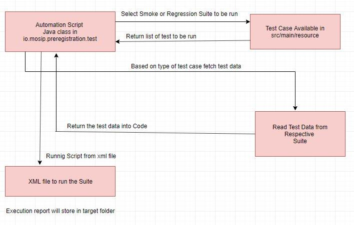 


## 2.2 Pre-requisites for understanding Java API automation
* Knowledge on Java 8
* Knowledge on Rest services
* Knowledge on maven
* Good analytical and debugging skill

## 2.3 Procedure to checkout-out the test code from the repository
* Navigate to git repository.
* Copy URI
* Open Git Bash
* Clone repository(git clone  “URI”)

## 2.4 Pre-configuration information prior to test run
None

## 2.5 Procedure to Add new test cases into the API test suite
1. From the code repository of the module, the test suites and cases can be located in the folder [**src/test/resources**]
1. Every API tests structure (test suite and test case) are stored in a folder/sub-folder approach. Let us take an example of “Create_PreRegistration” and Here you can see Create_PreRegistration is the suite name and inside that we have list of test cases.

  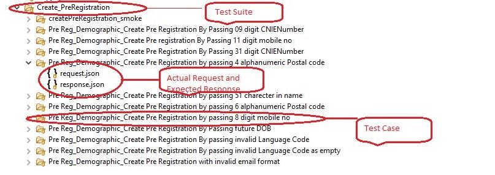 

3. To add new test case we need to create a folder inside test suite folder. You can give folder name same as test case name
1. Every test case name we need to add Create_PreRegistrationRequest.json file
 
  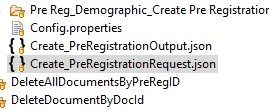 

5. In the Create_PreRegistartionRequest.json file, we need to mention all folder name(Test Case Name). 
When we run any class, then it will pick request body from folder and it will pick expected response. We will take request body, as input and it will give response (Actual Response).
For Validation, we are doing json to json comparison.
1. In Pre-Registration module, we have created on class called PreRegistrationLibrary, which is present in io.mosip.util package. In this class, we have created all reusable method, which is used, in Pre-Registration module.

   E.g.:-To book an appointment first we need to create an application, upload document, and then book appointment. Here for each operation we have created one method. 


## 2.6 Procedure to execute or Run the tests on a new environment
To run the automation suite of Pre-Registration module you will need an xml file named [**Pre-Registration_TestNG.xml**], which will be available under [**src/test/resources**]. In this xml file we need to add class name which we want to run.
 
   

## 2.7 Running a test suite
Procedure to execute the [**Reg-automation-service_TestNG.xml**] xml File:
1. Right click the xml file **Pre-Registration_TestNG.xml**
1. Select “Run as configuration”
1. Run as Maven
1. Select workspace(${workspace_loc:/automationtests})
1. In Goal Pass environment name,Base URI and  type of test case you want to run(smoke or regression)

   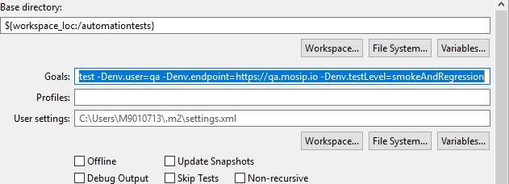 

   Here, -Denv.user indicates environment name.
   -Denv.endpoint indicates base URI
   -Denv.testLevel indicates types of test case we want to run
 
6. Select or Click the button “RUN”
1. Test Suites execution will commence.
1. Test report will be stored in [**surefire-report**] folder under the base directory/project
 
   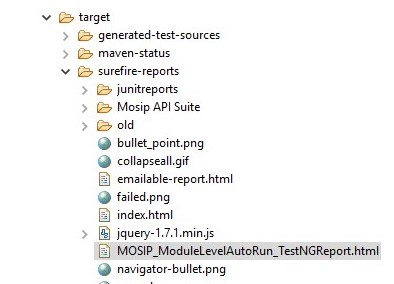 

## 2.8 Running a single test case
1. Right click on class, which you want to run.
1. Click on run as
1. Click on testing
1. Select class
1. In VM argument pass 
   -Denv.user=qa -Denv.endpoint=[link](//qa.mosip.io) -Denv.testLevel=smokeAndRegression

## 2.9 Analyze the test reports
* Once run is complete, then refresh project and go to target/surefire folder.
* Open MOSIP_ModuleLevelAutoRun_TestNGReport.html report.
* To analyze failure test case check exception message. 

# 3. Registration Client Test Automation Suite - User Guide
## 3.1 About the Registration Client Module
An important client interface module of MOSIP, which captures the Biometric and Demographic information of the Individual resident. This module also stores supporting information such as proof documents and information about the guardian or introducer as per the configuration set by the Admin. The packet creation is finished in this module in a secure way using sophisticated encryption algorithm and later send to the server for online mode of processing. The registration client test suites comprises of tests related to UI and Java API’s.

The test execution module of the Registration client module involving Java API’s is as depicted below

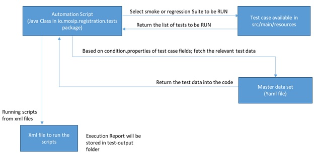 

## 3.2 Pre-requisites for understanding Java API automation
* Knowledge on Java 8
* Basic knowledge on Spring services and should know annotations
* Knowledge on maven
* Good analytical and debugging skill

## 3.3 Procedure to check out the test code from the repository
 
Instruction to checkout code from GitHub using Eclipse.
* Open eclipse
* Go to quick access and search “clone git”

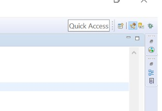 

   **Figure 1**


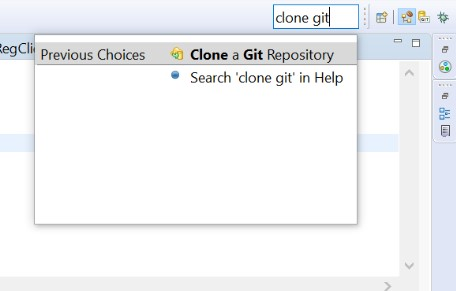 

   **Figure 2**

* A pop up will appear in that enter the URI, Host and Repository path as same as below. Pass your GitHub username and password and click on next.

  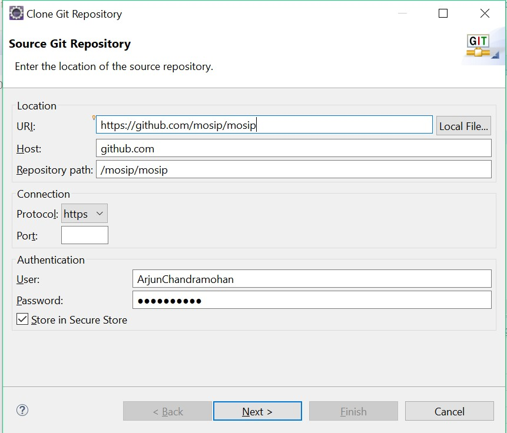 
 
* Search the branch name, select it, and then click next. Our latest branch name as [link](/mosip/mosip/tree/0110_Sprint11_Reg_Automation).

  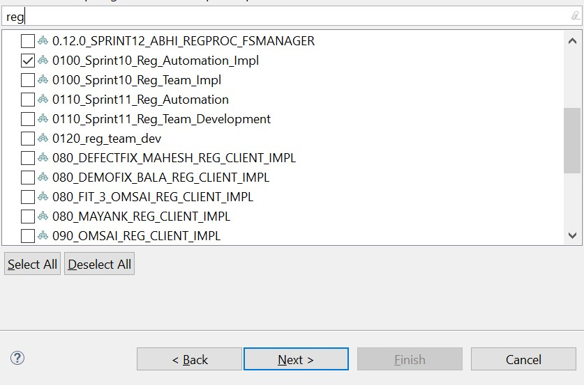 
 
* Browse the directory to pull the code.

  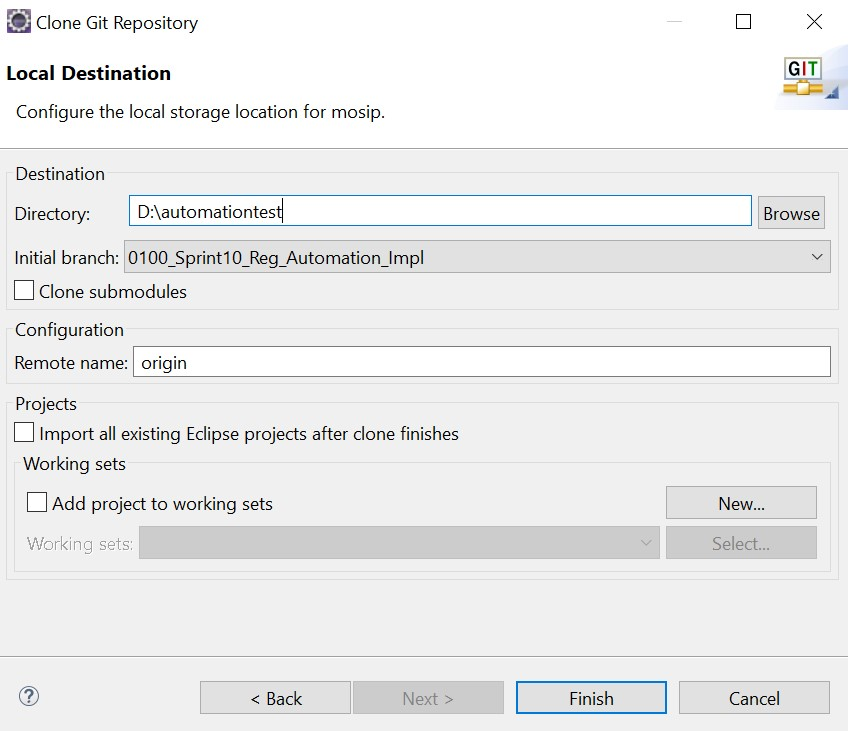 
 
* Now the code will be in eclipse git repository. Import the required project to the workspace. For registration client automation, we want to import kernel and registration projects.

  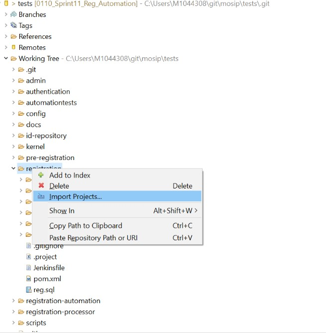 
 
## 3.4 Pre-configuration information prior to test run
None

## 3.5 Procedure to Add new test cases into the API test suite
1. From the code repository of the module, the test suites and cases can be located in the folder [**src/test/resources**]
1. Every API tests structure (test suite and test case) are stored in a folder/sub-folder approach. Let us take an example of “**Email Notification service**” and explain how to add a new test

   

3. Every test case will have a configuration property file named [**condition.properties**] in its sub-folder as shown below

   

4. In this condition.properties file, we need to mention the parameter type that needs to be sent to the API. [**valid**] indicates the value passed is a correct/right data and [**invalid**] indicates the data being sent is an incorrect/wrong data.(we can also check the parameter behavior for the empty and space also, for that we can pass the value as **space** and **empty** respectively in condition.properties) This information has to be entered for every field/parameter that the API consists. 

   

Based on values set inside the **condition.properties** file test cases will fetch the data from yaml file and then call a data generator code internally which shall add meaningful right or incorrect values as test data into these variables. 
More information on the Yaml file can be found under appendix

## 3.6 Procedure to execute or Run the tests on a new environment
To run the automation suite of Registration Client module you will need an xml file named [**Reg-automation-service_TestNG.xml**], which will be available under [**src/test/resources**].

## 3.7 Running a test suite
Procedure to execute the [**Reg-automation-service_TestNG.xml**] xml File:
1. Right click the xml file Reg-automation-service_TestNG.xml
1. Select “Run as configuration”
1. Under configuration select [TestNG] and pass the VM argument as
   -Dspring.profiles.active=required environment (which could be either of QA or INT or DEV) 
 
   -Dmosip.dbpath=DB path 

   *DB path – this is the local DB path where all the sync happens and other data’s get updated while running the code. The empty DB name is available in /registration/registration-libs/src/main/resources/db/reg . We are copying this empty DB in our project and passing as vm argument while running the code.

   -Dmosip.registration.db.key=DB key path

   Sample representation of the VM argument is as below
   
   ``-Dspring.profiles.active=qa  
   -Dmosip.dbpath=reg 
   -Dmosip.registration.db.key=D:\keys.properties``
4. Select or Click the button “RUN”
   Test Suites execution will commence.
5. Test report will be stored in [test-output] folder under the base directory/project

## 3.8 Analyze the test reports
After running the tests, report will get generated in “test-output” folder in project. Name of the report is “custom-emailable-report.html”

Sample report:

 
## 3.9 Appendix

**1. Java API**

   Java application programming interface (API) is a list of all classes that are part of the Java development kit (JDK). An application-programming interface (API), in the context of Java, is a collection of prewritten packages, classes, and interfaces with their respective methods, fields and constructors.
For more detail, refer to the [link](//resources.saylor.org/wwwresources/archived/site/wp-content/uploads/2013/02/CS101-1.3.5.3-Java-Application-Programming-Interface-API-FINAL.pdf)

**2. Yaml master data file**

   Yaml file is the master data set for testing the API, Sample Mater Data set is as below:

   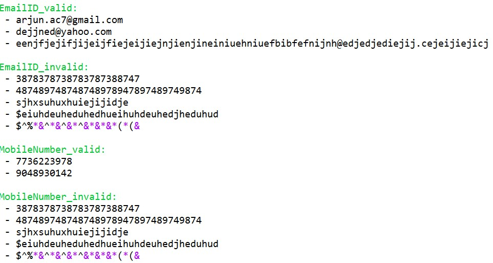 

**3. How to increase the data coverage inside Yaml file?**

   To increase the data coverage we can add as many as test data’s into the Yaml file 

**4. Any dependencies of values in the Database**

None


# 4. Registration Processor Test Automation Suite - User Guide
1. How to add test cases for a new API?

2. How to run the Reg Proc automation suite?

3. How to enhance the existing data coverage?

# 5. ID Authentication (IDA) Test Automation Suite - User Guide
1. How to add test cases for a new API?

2. How to run the IDA automation suite?

3. How to enhance the existing data coverage?

# 6. E2E Test Automation Suite - User Guide
1. How to add test cases for a new API?

2. How to run the IDA automation suite?

3. How to enhance the existing data coverage?

# 1 Introduction
## 1.1 Overview
The MOSIP architecture mainly consists of the following functional blocks/modules
* Pre-Registration - Web application designed in Angular JS
A resident can provide his demographic details in this web application and book an appointment for his future registration at a registration center
* Registration Client - A Desktop thick client application developed in JavaFX.
A resident is registered through the Registration Client software to generate get a unique identification number. The software captures demographic and biometrics information of the residents. It is connected to scanner devices (finger print, iris), camera and printer to capture resident biometrics information
* Registration Processor - A backend server application developed using SEDA framework
It processes the client packets and generates UIN based on de-dup information from ABIS (Automated Biometrics Identification System)
* IDA (ID Authentication) - A backend authentication server developed using spring family. 
It authenticates the resident based on registered set of biometric and demographic information

Test automation is the key to the success of comprehensive test coverage and test data. However in the context of MOSIP testing, where there are external devices and integration with third party software, test automation cannot be exhaustive and comprehensive test coverage can be achieved by testing driven by manual intervention, along with test automation.

In this document we will also talk about utilities for test data generation, tools for test automation and test strategy in general.

<!---MOSIP SOAPUI tests are developed as an open source framework project. The tests developed using soapui with the following best practices.--->

## 1.2 Scope
1. Test Coverage

  * Each of the modules has the following building blocks which are the testable entities, at the module level

 Module | Testable Entities | Levels of Testing | Comments |
 -------|-------------------|-----------------|-----------
 Pre-Registration | <li> UI <li> REST APIs | <li> UI Functional Testing <li> Individual API testing <li> API level integration testing | | 
 Registration Client | Java APIs | <li> UI Functional Testing (with simulators and with devices) <li> Individual API testing <li> API level integration testing | | 
 Registration Processor | <li> Java APIs <li> SEDA vert.x stages | <li> Individual API testing <li> Integration workflow testing including the APIs and Vert.x for processing various packet types| | 
 IDA | REST APIs | <li> Individual API testing <li> Integration workflow testing | | 
 Kernel | REST APIs | <li> Individual API testing <li> Integration workflow testing | | 

  * System Integration Testing -
    This involves testing functional workflows across the modules, starting from Pre-Reg and ending in IDA

* Test Automation - tools, approach, test code configuration management process, regular usage

2. Data Coverage
* Data utility tools - approach, usage
3. Test Management Tools
4. Defect Management & Lifecycle

# 2 Test Approach
Each module is tested, both manually and through automation software for effective test coverage.

A progressively evolving test approach is being adopted in both cases. 
1. Manual Testing starts with module level functional coverage followed by --> integration across modules --> End to end workflow testing
2. Automation Testing starts with the fundamental building blocks like APIs, and grows up the stack. 
* Individual API verification is followed by --> API Integration testing --> integration across modules --> End to end workflow testing

## 2.1 API Testing
API testing will be carried out in 2 stages, both via Test Automation.
1. Soap UI automation - This approach is mainly to catch up with the backlog and disclose bugs soon, however this approach has disadvantages when the APIs undergo changes
2. Restassured API test framework development and test automation - This will be a more generic framework, that is both modular and comes with less cost of maintenance

### 2.1.1 Restassured API Test Framework 
In this approach the request and response APIs will be templatized. The input request API template will be parameterised via a data utility, which also prepares the expected response JSON file. The request is then posted to get the actual response. The actual and expected response JSONs are compared to verify the result. 
Data utility also handles the transliteration of input values.

API Automation will be done using Rest Assured IO DSL using Java. The tools/Libraries used are as below:

* IO Rest Assured DSL
* TestNG
* Java/J2EE
* Eclipse Editor

The framework consists majorly 3 Elements/parts as below:
	
* Test Data
* Test Scenario
* Test Execution and Assert
* Results/Reporting

Directory Structure:

#### 2.1.1.1 Test Data
Test Data is maintained under the path src/test/resources. Every module's data is saved separately from other module with folder name as module name(say Kernel).

Every API under specific module is saved as folder name. All test cases belonging to an API are saved with separate folders; the name of folder being the name of the test case. Each test case folder has 2 jsons; one for request.json and another refering expected response.json.

It looks as below:

src/test/resources/moduleName/apiName/testCaseName/Request.json
src/test/resources/moduleName/apiName/testCaseName/Response.json

Example: 

src/test/resources/Kernel/FetchDevice/invalid_deviceType_blank/Request.json
src/test/resources/Kernel/FetchDevice/invalid_deviceType_blank/Response.json

#### 2.1.1.2 Test  Scenario

Test Cases are formed around api's behavior and its attributes. Every api will have valid and invalid scenarios with varying combination of attributes of the api. First success scenario test cases are formed by keeping all attributes as valid. Then error scenarios are formed by updating a field as invalid one at at time. 
Each folder name under specific api represents an individual test case.

#### 2.1.1.3 Test Execution and assert
IO Rest Assured methods (POST, GET, PUT, and DELETE) used to run the requests. These methods saved under Common Library so that same methods are re-used.Test are executed using io rest assured DSL libraries. All methods are implemented under CommonLibrary.java and ApplicationLibrary.java file contains generic methods to accept input body and resource uri. These files can be located under io.mosip.util package.

All tests are maintained module wise; each class under tests represent an api specific to the module. The name of the java class is same as api name. The same java class is having test methods to run multiple test data combination for an api.


The directory structure is:


io.mosip.kernel.tests

io.mosip.preregistration.tests

io.mosip.authenticatiion.tests

io.mosip.registrationprocessor.tests

Example test class file: io.mosip.kernel.test.AuditLog.java

After getting actual response from the service, the actual response body is compared with expected response body by using hashcode and then json to json comparison by removing dynamic elements from both response json.  Response files are converted to Json Object using Json Mappers and then Object to Object is compared. The code for assert is present under: io.mosip.service.AssertResponse java file.

#### 2.1.1.4 Test Results/Reportig
Based on the assert function output a test is decided as PASS or FAIL and then written to TestNG default report emailable.html report. This report can be found under test-output/emailable-report.html. The same is circulated to other audience after pipeline QA build.
 
## 2.2 API Testing Strategy

API Testing is broadly classified as Component and integration(Scenario) testing.

### 2.2.1 Component Tests
Component tests are like unit tests for the API - It checks individual methods available in the API in isolation. We create these tests by making a test step for each method or resource that is available in the service contract. 

The easiest way to create component tests is to consume the service contract and let it create the clients. We will then data-drive each individual test case with positive and negative data to validate that the responses that come back have the following characteristics:

* The request json payload is well-formed (schema validation)
* The response json payload is well-formed (schema validation)
* The response status is as expected (200 OK, SQL result set returned)
* The response error payloads contain the correct error messages and error codes
* Assertion - the individual elements in the response match our expectations (presence of specific element, datatype of element etc).
* The service responds within an expected time frame 
* Validate how the system behaves when some request headers are missing, e.g., Content-Type, Authorization, etc.
* Checking what happens if provide query parameters for a method that should accept only form parameters in a body
* Verifying whether a protected resource is not available over HTTP when it should be only on HTTPS
* Business logic testing. Say while Fetching application (PreId) presence of valid Preregistration ID is mandatory in the request.
* Positive and Negative testing. Making sure that if you make a bad request, it responds as expected.

These individual API tests are the most important tests that we build because they will be leveraged in all of the subsequent testing techniques.  These tests simplify the process of approaching API testing.

### 2.2.2 Integration/Scenario Tests
Under this type of testing, we assemble the individual component tests into a sequence, much like the example described as below.

Ex: Create Application, Upload Document, Book appointment and Fetch Application data.

There are two great techniques for obtaining the sequence:
1. Review the user story to identify the individual API calls that are being made.
1. Exercise the UI and capture the traffic being made to the underlying APIs.

**Approach:**

An individual method is created for all of the preregistration apis with method name as api name. Inputs for the method will be refered from specific module/api/valid or invalid scenarios (Ex: src/test/resource/prereg/CreateApplication/createPreRegistration_smoke) which is already maintained as part of component testing. All these methods are written under io.mosip.util.PreRegistrationLibrary.java class file.
Scenario is designed by calling the methods in the same order as transaction happens in real life as illustrated below.

Scenario to delete a document for the Booked appointment. Sequence of actions accomplished using api specific methods are:

CreateApplication()

DocumentUpload()

BookingAppointment()

DeleteDocumentByPreId()


Integration tests allow us to understand if defects might be introduced by combining different data points together.


## 2.3 Module level testing
MOSIP module level testing cannot be completely automated due to the use of scanner devices and others that involve manual intervention. Therefore the following approach will be adopted for creating a controlled end to end regression test suite that considers no devices, but simulators. This also includes the simulation of ABIS responses via a ABIS Simulator.

# 3. Registration Client Approach

Please ensure the following prerequisites is available in the machine from where we are going to launch and test the application:
1. Updated derby DB 
2. Registration-UI jar
3. Java version (build 1.8.0_181-b13)

First in order to launch the application, we must configure our machine to the center and it can be achieved by inserting a query in Derby DB where user will insert / update the MAC address of the particular machine from where user launches the application.

# 4. Login Functionality:
To create a packet, the user must have a valid user name and password and more importantly on-boarded to the machine. The User can create one using insert query in "User details" table in Derby DB.Once logged in to the application, the user will be routed to "Home screen" where the user has option to start a New Registration, UIN Update and Lost UIN. If the credentials are not valid or the user is not on-boarded then the application will display appropriate error message and restricts the user to proceed further

# 5. Packet Creation:

## 5.1 Pre-Registration Sync:
The resident's are allowed to provide their Demographic and basic proof documents via online. Upon completion of those information, they will be provided with a PRID. Post that the resident are supposed to make an appointment to the registration center and complete the registration. Once the PRID is generated, the pre-registration team will provide a service through which they will put all PRID available for the registration client and in turn RC team will get those in to their DB by Pre-Registration sync.

## 5.2 Demo Data Capture:
Using New Registration tab on home screen, the user can either enter the resident's detail manually or the user can fetch the details using PRID(Pre-registration ID). When user fetches the details using PRID, the RC will check whether the information is available in DB and if not it will check online and based on availability it will display the details. If in case, the details are available in both places, then it will fetch it from online considering the online is the recent and updated one. All mandatory fields needs to be captured and the configured secondary language will display the same on the right hand side of the application. If user wants to transliterate the information, then using virtual keyboard the user can enter the data.

## 5.3 Document Upload
Once demographic information are captured, the user has to upload the necessary documents through document upload screen and the document category will come from Master data. The user will not be allowed to upload more than one document type for a single category. The RC should not have an option to store or export it to external devices but must have access to view and delete it.

## 5.4 Biometric capture:
Since due to non-availability of external devices, biometric details are stubbed while creating a packet. Biometric details like Fingerprint (4+4+2), IRIS (1+1) and Face photo. Except applicant photo, all other details are stubbed.Also the biometric details are placed as CBEFF file format in the packets.

## 5.5 Preview
After user has captured all the information, the application will display the preview screen where the user and resident will re-verify for correctness of information. If something needs to be changed, using Edit option the user will change the value and complete the registration capture process

## 5.6 Registration Authentication
The final step to create a packet is by authenticating it with RO credentials. The packets which have biometric exception information will need supervisor credentials for authenticating it. Upon successful authentication, the packet will get created and stored in the default configured path. 

# 6. EOD Process:
In EOD process, the user can either approve a packet or reject with reasons. The list of reason to reject will come from master data and this can be achieved by sync job. Only supervisor will have access to EOD process. Once supervisor logged in and start to approve the packet. Before approving, all pending approval packets are available in "Pending approval" queue. Select a packet / group of packets and user can approve / reject based on necessity. 

# 7. Upload Packets:
Click the upload button and all the internal approved packets will get uploaded and moved to the server. The UI will display the uploaded status whether it is uploaded successfully or not. 

# 8. Packet Validation:
## 8.1	Basic Checks:
1. Packet store folder and packet availability
2. Acknowledgement
3. Packet is encrypted or not

## 8.2	Advanced checks: 
1. Decrypt the packet using the utility and verify the packet structure like availability of Demo, Bio, HMAC, Documents uploaded, Exception info, Supervisor and RO info 


**<GITA - context setting and high level approach continues here>**

Reg Client Automation Approach

Registration Client is thick Desktop application built using JavaFX accessible in Windows and Linux machines. The Enrollment Client expects inputs from user in the form of Demographic and Biometric and generates Registration ID by exposing several Java and Restful apis. 

Tools/Technology Used: TestFX, Java, Maven, Junit 5, Eclipse, derby db

Page Object Model
The framework customized is Page Object Model (POM), each screen/Object view is treated as an individual page. Input Data, Page locators and test logic are segregated from each other. They are loosely connected to accommodate the future changes with lesser maintenance effort.
The below diagram depicts the high level view.


* Core framework – which holds common code for functions, Input Data, the controller script and generic services like logging, exception handling
* Page Object – These are the pages, which hold info about the pages/object view relative to their locators, values and respective page assertions

Following is the description of each package/module under the framework
1. Input Data Handling
DataUtil is the provider of Demographic and Biometric input provider. It generates multiple samples of simulated Biometric data for fingerprints, Iris and photo. The util in turn uses sample simulators to generate unique set of data dynamically at runtime.

2. Base Package
It holds the entire configuration to initialize and trigger the Runner class to start the execution. It instantiates stage robot elements of TestFX.

3. Page Handling
Each screen of JavaFX represents a Page and it is implemented using Enum classes of Java. Constants under the enum class (separate enum for each screen/page) holds locator, values and behavior/method to interact with the screen. It also encapsulates the assertion messages specifically for any behavior.
Ex: Login Page, Registration Page etc

4. Test Scripts
Test Scripts are implemented using TestFX and Java code. TestFX provides Robot api with rich collection of keyword mouse movement/interaction libraries. It also provides Hamcrest matchers to assert tests.
Every script starts calling Datautil for input data based on the scenario. Relevant page/enum values are used to customize the behavior. Test is asserted for its result referring static data mainted under pages.

5. Exception Handling
Every behavior is associated with success and parallel failure scenario. All the failures are caught with systematic error handling using try/catch block and user will be prompted with meaningful messages on the action to be taken further. 
Exceptions might also arrive at the integration (say SDK devices while capturing images), they are also handled based on the scope (Device or Enrollment Client). Device connectivity is checked at the code.

6. Reporting and Screenshot
All execution are captured in a report along with attached screenshot of failed test cases in case of failure. Report listener is added at test script level to get detailed logging and report on execution status. 

**Test Scripts Types:**
**Health Checks**
Need to come up with Health check tests for:
1.	All Interfaces (Integration Points)
2.	All Connectivity points

**Exception Handling**
Tests should be robust enough to handle error scenarios like
1.	Exception while capturing images
2.	Exception while processing data

**Functional Validation**
Tests to validate the functionality of each screen either with Successful or Error scenario coverage

**Sample directory structure from the current framework**


# 9. Data Coverage
The approach includes creating data generation utilities for specific purposes in testing 
There are 5 data generation utilities with the following purposes 
1. for testing Pre-Reg and Reg Client UIs
2. for testing Pre-Reg APIs
3. for testing Kernal APIs
4. for testing Reg-Proc APIs
5. for testing IDA APIs

The utilities are flexible and easy to use
* Manual test team uses the utility for testing UI and Rest API testing
Manual Testing team can run the test data util jar in local machine and generate test data any time.

* Automation test team uses them for test automation of API and E2E scenario 
The test data util is integrated with the automation code to generate data at run time and carry out the automation tests.

Design: 
The utility is designed to take input data from a configuration file generates varied combinations of data dynamically and it is different for each run of the utility there by generating random but specific combinations that can be used.

Test Data Util uses 2 files as input:
Config property file - where user can configure below things:
 - number of test data output jsons need to be generated
 - fields for which the test data is required
 - output json file name to be generated
 - valid/invalid data to be generated for each field

Master yml file - is basically a dictionary that contains all valid and invalid data for each field as separate tags.
Test data util when run picks the random data from respective tags in master yml file based on the configuration provided by the user in config property file.

<!---This document covers the automation testing standards, for the RESTful webservice testers.--->

# 10. Structuring Tests for API testing
## 10.1 Naming Convention

Project Name as Mosip

Every module as Test Suite

Test Suites are as below:
* Pre-Registration 
* Reg-Proc
* IDA
* Kernel

Note: As Registration module doe not have any Restful apis, not considered for automation.

**Test Case**

Naming convention followed as:

ModuleName SprintCycle_Type of Test_Fetaure_JIRA ID_Description

**ModuleName:**

* Pre-Registration - 1
* Reg-Proc -2
* IDA -3
* Kernel -4

Sprint Cycle: 1 , 2 ,3 etc

Type of Test as below:
1. Sanity
1. Progression
1. Regression
1. Progression and Regression both

JIRA ID – Relevant story under test

Description: Test Scenario explanation

Ex: 14_3_OTP_MOS-27_Verify OTP triggered successfully

The above test case is interpreted as this test case belongs to Pre-Registration module of  4th sprint, regression test case, testing OTP feature addressed using JIRA no as MOS-27 for test scenario “verify otp is triggered successfully”.

## 10.2 Header
Every test is to be preceded with Header script addressing below elements

Name: Name of the tests

Module: Module going to test

Author: Individual who is writing tests

Date: Date of development of tests

## 10.3 Functional testing of individual methods or operations

This testing ensures whether a method or operation performs the task correctly, which it is intended to do actually.
Example: Say if a POST method/operation ‘register’ used to create a user then a new user creation is completed with an entry into database.

## 10.4 Syntax checking of individual methods/operations
This type of testing is done to validate if it accepts only valid inputs and all invalid inputs are rejected with proper error code/messages.

## 10.5 Construct test scenarios
By clubbing, multiple methods/operations create End-to-End regression scenarios.

Example: Simulate Input Data -> Trigger OTP -> Generate OTP -> Get OTP -> Authenticate OTP
										
## 10.6 Exceptional behavior checking
	
This type of testing is performed to check if apis fail gracefully with proper error code and error messages. Need to simulate error scenarios and validate the 4xx and 5xx series of status codes.	

Sending incorrect or invalid parameters to the API triggers a negative outcome, which is commonly an error message or other indication of a problem

## 10.7 Database Validation
The data created/Updated/Deleted should be validated against DB entry with JDBC step using the tool.

# 11 Input Data Handling

## 11.1 Parsing/generating input data 

Input data should be handled as master json file and then it is parsed across the soapui project to refer input elements.
Groovy scripting is used to generate data dynamically (Ex: email address).

All input json files are saved in git and accessed accordingly.

## 11.2 Use realistic data 

Make it a priority to understand the rationale behind the API, along with the information being sent to it, both in design and in practice.

## 11.3 Mock Services

As part of End-to-End testing if feature is not available (out of scope for feature under test and not yet implemented), create Mock services using SOAP UI tool. Also, can create stubs using Groovy scripting.

## 11.4 Capturing Logs

As part of proof of validation, save logs of execution; which can then be transferred to git repository as a reference point.

# 12 Assertions

## 12.1 Add as many as assertions
	
Cultivate habit of adding assertions as many as possible which would uniquely validates whether a test is pass or fail. Use tool assertions, which would be quicker and reuse script assertions wherever required.

## 12.2 Dynamic assertions

Tightly couple assertions with dynamic data, which is generated as part of test execution. This will ensure the expected result exactly matches the requirement along with changing data.

Example: txn_id in the response should match with txn_id in request, which is dynamically generated each time test is run. Add Json path assertion to check txn_id in response is same as txn_id in the request.

# 13 Scope of apis

Get the clarity of feature under scope of testing. Testing the features which are not under current scope and 3rd party operations should be avoided.  3rd party apis are tested only to check if it is prompting expected element/status. This strategy helps us to arrive with quality tests. 

# 14 Test Strategy
## 14.1 Registration Processor
Registration Processor is the core part of MOSIP where the Identity and Validation of resident’s enrolled data happens, and on a successful verification UIN will be generated and delivered to the residents. Functional verification and security aspects plays a critical role in evaluation of Registration Processor. Unlike the regular black box testing, this will be more of a Grey box testing that involves verification of the stages for the Registration Processor Module of the MOSIP Software.
## 14.2 Module Level Testing
This testing ensures Registration Processor Module level operation performed correctly (intended) without any issues. Example: Registration Processor starts with uploading packets leading to virus scan, then to Packet store and finally creating the UIN. 
## 14.3 Registration Processor Workflow 
Following are the high level positive and negative scenarios covering the below shown workflow diagram of the reg proc module

Number | Test Scenarios | Category| 
-----  | -----------------|-------------|
1 | Verify Packet is Unique/Duplicate | 	Functionality | 
2 | Verify Packet sync for which packet generated from Registration client | 	Functionality |
3 | Verify whether Virus scan is success/Failure for RID Packet | 	Functionality |
4 | Verify Packet Archival location | 	Functionality |
5 | Verify Packet Decryption with the valid key store | 	Functionality |
6 | Verify Packet Decryption with the invalid key store | 	Functionality |
7 | Verify Packet Integrity with valid check sum value | 	Functionality |
8 | Verify Packet Integrity with invalid check sum value | 	Functionality |
9 | Verify structural validation with valid packet structure | 	Functionality |
10 | Verify structural validation with invalid packet structure | 	Functionality |
11 | Verify  Demographic Dedupe for valid Packet | 	Functionality |
12 | Verify  Demographic Dedupe for Packet having Duplicate Demographic info | 	Functionality |
13 | Verify   Biometric Dedupe for valid Packet | 	Functionality |
14 | Verify  Biometric Dedupe for Packet having Duplicate in biometric info | 	Functionality |
15 | Verify Manual adjudication when demo dedup is Failure | 	Functionality |
16 | Verify Email Notification | 	Functionality |
17 | Verify UIN generation  | 	Functionality |
18 | Verify Invalid Packet naming convention  | 	Functionality |
19 | Verify Packet name exceeding less than 29 digits  | 	Functionality |
20 | Verify Packet name exceeding more than 29 digits | 	Functionality |
21 | Verify Invalid Fotrmat  | 	Functionality |
22 | Verify SMS Notification  | 	Functionality |
23 | Verify RegistrationProcessorIdentity json file   | 	Configuration |
24 | Verify Camel route XML  | 	Configuration |
25 | Verify bio-dedupe-service max result  | 	Configuration |
26 | Verify packet-receiver max file size in mb | 	Configuration |
26 | Verify bio-dedupe-service threshold  | 	Configuration |
27 | verify packet-manager virus scan location when empty  | 	Configuration |


## 14.4 Pre-requisite for Reg Proc testing
1.	Create resident test packet from reg client
2.	Ensure Reg Proc and all its associated job are up and running

 | Jobs | 
 | -----------------| 
 | packet-receiver-stage-1.0.0-SNAPSHOT.jar |
 | virus-scanner-stage-1.0.0-SNAPSHOT.jar |
 | packet-uploader-stage-1.0.0-SNAPSHOT.jar |
 | osi-validator-stage-1.0.0-SNAPSHOT.jar |
 | demo-dedupe-stage-1.0.0-SNAPSHOT.jar |
 | packet-bio-dedupe-api-1.0.0-SNAPSHOT.jar |
 | registration-processor-abis-1.0.0-SNAPSHOT.jar |
 | bio-dedupe-stage-1.0.0-SNAPSHOT.jar|
 | ui-generator-stage-1.0.0-SNAPSHOT.jar |
 | manual-verification-stage-1.0.0-SNAPSHOT.jar |
 | packet-validator-stage-1.0.0-SNAPSHOT.jar |


3.	Ensure DB is up and running fine. 
4.	Ensure the required DB scripts (Master Data / Schema) are executed.
5.	Required Privileges to DB for Testdata updates to create positive / negative flow.
6.	Ensure all the depended services are deployed.

## 14.5 Test Step
Registration packets created by the registration clients will be periodically uploaded to the server for processing. The packets will be stored in Virus scan folder initially and status will be updated in registration status table. 

In case of successful Virus Scan, packets move to DFS. In case of Virus Scan failure, packets move to Retry Folder. The statuses of these packets is in the Enrollment Status Table.

Packets are successfully uploaded to file system and ready for decryption. Decrypt the encrypted zip file and receives a Zip file. Unpack the Zip file. Store the unpacked files in file system. Using  RSA PKI Algorithm we create Public keys/private Keys through which will do packet decryption. After Packet decryption, Packet will go and check Packet integrity HMAC Algorithm used to validate the (Check sum value) and structure.
After successful packet structure validation, the packet Meta info is stored in DB. The user, machine and center information will be further validated at Master Data in DB to check if authorized person creates the packet.
After successful Bio dedupe, the UIN Generator will be called to allocate an unique identification number to the applicant by using 'kernel-idgenerator-uin' Rest API to generate UIN. It will return the unique id which will be allotted to the applicant.it will call kernel-idrepo-service create API to add a new applicant to id repository. After successful response from the idrepo-service, store the uin information in registration processor db. Update individual_demo_dedupe table with uin information against the registration id.

### 14.5.1 OSI Validation
Testing an OSI validation we populate the MASTER DB with User,machine,center details in a combination set with valid / Invalid Details. We create packets using Utils by passing valid/Invalid details of User/Machine/Center Details .The validation of OSI stage DB record for each condition will be verified.
### 14.5.2 Demo Dedupe:
Demo dedupe records matching GENDER,NAME and DOB  .Perform demo dedupe on all potential 'demo dedupe records' with 'applicant demographic information' using levenshtein distance algorithm. However for Testing we modify the DB with UIN with pre populated data . We use the same of set data while creating the packet to validate the condition.
### 14.5.3 Configuration:
Camel route xml is implemented in the private network where the stages are running on loosely coupled.By Modifying the route in-out of the vertx end point we validate the stages behaviors . 
### 14.5.4 Bio-Dedupe:
We create packet with dummy tag as unique / duplicate in CBEF which passed on Mock ABIS service to validate the Bio-Dedupe. Based on the tag ABIS decide the uniqueness of the packet .  


## 14.6 Test Data
Registration processor takes input as packet , the validation of stages involves data carried inside the packet. To validate positive and negative conditions we need to create the different combination of packet as mentioned below.

 | Packet with different Conditions | 
 | -----------------| 
| Registration Packet size < 5 MB  |
| Registration Packet size >5 MB (Max size Config) |
| Half info Packet / Missing info |
| Existing RID in DB |
| packet name with Valid Centre ID |
| packet name with valid Machine ID |
| packet name with valid Centre ID and valid Machine ID |
| packet name with  Invalid Centre ID |
| packet name with Invalid Machine ID |
| packet name with Ivalid Centre ID and invalid Machine ID |
| packet name with invalid Centre ID and invalid Machine ID |
| packet name with invalid Centre ID and valid Machine ID |
| packet name with Invalid Packet naming convention - Date |
| packet name with Invalid Packet naming convention - Month |
| packet name with Invalid Packet naming convention - Year |
| packet name with Invalid Packet naming convention - Time (H) |
| packet name with Invalid Packet naming convention - Time (M) |
| Invalid Packet naming convention - Time (S) |
| Valid Packet naming convention - Date |
| Valid Packet naming convention - Month |
| Valid Packet naming convention - Year |
| Valid Packet naming convention - Time (H) |
| Valid Packet naming convention - Time (M) |
| Valid Packet naming convention - Time (S) |
| Packet name combination - Text + Symbol |
| Packet name combination - Text + Number |
| Packet name combination - Symbol + Number |
| Packet name combination - Invalid Date + Invalid Month |
| Packet name combination - Invalid Date + Invalid Year |
| Packet name combination - Invalid Date + Invalid Time (H) |
| Packet name combination - Invalid Date + Invalid Time (M) |
| Packet name combination - Invalid Date + Invalid Time (S) |
| Packet name combination - Invalid Year + Invalid Month |
| Packet name combination - Invalid Time (H)+ Invalid Month |
| Packet name combination - Invalid Time (M)+ Invalid Month |
| Packet name combination - Invalid Time (S)+ Invalid Month |
| Packet name combination - Invalid Year + Invalid Time (H) |
| Packet name combination - Invalid Year + Invalid Time (M) |
| Packet name combination - Invalid Year + Invalid Time (S) |
| Packet name exceeding less than 28 digits |
| Packet name exceeding more than 28 digits |
| Virus scan success |
| Corrupted file - Virus scan failure |
| Invalid Applicant - BothThumbs |
| Invalid Applicant - Left Finger |
| Invalid Applicant - Right Finger |
| Invalid Applicant - Both Left and Right Eye |
| Invalid Applicant - Left Eye |
| Invalid Applicant - Right Eye |
| Valid Applicant - BothThumbs |
| Valid Applicant - Left Finger |
| Valid Applicant - Right Finger |
| Valid Applicant - Both Left and Right Eye |
| Valid Applicant - Left Eye |
| Valid Applicant - Right Eye |
| Invalid Introducer - BothThumbs |
| Invalid Introducer - Left Finger |
| Invalid Introducer - Right Finger |
| Invalid Introducer - Both Left and Right Eye |
| Invalid Introducer - Left Eye |
| Invalid Introducer - Right Eye |
| Valid Introducer - BothThumbs |
| Valid Introducer - Left Finger |
| Valid Introducer - Right Finger |
| Valid Introducer - Both Left and Right Eye |
| Valid Introducer - Left Eye |
| Valid Introducer - Right Eye |
| Demographic  - Invalid ApplicantPhoto |
| Demographic  - Invalid ExceptionPhoto |
| Demographic  - Invalid ProofOfAddress |
| Demographic  - Invalid ProofOfIdentity |
| Demographic  - Invalid RegistrationAcknowledgement |
| Demographic  - Valid ApplicantPhoto |
| Demographic  - Valid ExceptionPhoto |
| Demographic  - Valid ProofOfAddress |
| Demographic  - Valid ProofOfIdentity |
| Demographic  - Valid RegistrationAcknowledgement |
| Valid DemographicInfo JSON file |
| Invalid DemographicInfo JSON file |
| Valid audit JSON file |
| Invalid audit JSON file |
| Valid PacketMetaInfo JSON file |
| Invalid PacketMetaInfo  JSON file |
| Valid EnrollmentOfficerBioImage  |
| Invalid EnrollmentOfficerBioImage  |
| Valid EnrollmentSupervisorBioImage |
| Invalid EnrollmentSupervisorBioImage |
| Valid HMACFile |
| Invalid HMACFile |
| Invalid EnrollmentOfficerBioImage and EnrollmentSupervisorBioImage  |
| Invalid EnrollmentOfficerBioImage and HMACFile  |
| Invalid EnrollmentOfficerBioImage and PacketMetaInfo JSON file |
| Invalid EnrollmentOfficerBioImage and DemographicInfo JSON file |
| Invalid EnrollmentSupervisorBioImage and HMACFile  |
| Invalid EnrollmentSupervisorBioImage and PacketMetaInfo JSON file |
| Invalid EnrollmentSupervisorBioImage and audit JSON file |
| Invalid EnrollmentSupervisorBioImage and DemographicInfo JSON file |
| Invalid HMACFile and PacketMetaInfo JSON file |
| Invalid HMACFile and audit JSON file |
| Invalid HMACFile and DemographicInfo JSON file |
| Invalid PacketMetaInfo JSON file and audit JSON file |
| Invalid PacketMetaInfo JSON file and DemographicInfo JSON file |
| Invalid audit JSON file and EnrollmentOfficerBioImage  |
| Invalid audit JSON file and DemographicInfo JSON file |
| Unique Packet |
| Duplicate Packet |
| Duplicate request - Packet is up for retry- success |
| Duplicate request - Packet is up for retry- Failure |
| Packet integrity validation - successful |
| Packet integrity validation - Failure |
| Virus scan - successful |
| Virus scan - Failure |
| Decrypt packets - successful |
| Decrypt packets - Failure |
| Metadata validation - success |
| Metadata validation - failure |
| File validation - Successful |
| File validation - failure |
| Insert packet data in DB - successful |
| Insert packet data in DB - successful |
| Data validation - success |
| Data validation - failure |
| Active officer Authentication Success Using finger |
| Active officer Authentication Failure Using finger |
| Active officer Authentication Success Using Iris |
| Active officer Authentication Failure Using Iris |
| Active officer Authentication Success Using pin |
| Active officer Authentication Failure Using pin |
| Active officer Authentication Success Using Password |
| Active officer Authentication Failure Using Password |
| supervisor Authentication Success Using finger |
| supervisor Authentication Failure Using finger |
| supervisor Authentication Success Using Iris |
| supervisor Authentication Failure Using Iris |
| supervisor Authentication Success Using pin |
| supervisor Authentication Failure Using pin |
| supervisor Authentication Success Using Password |
| supervisor Authentication Failure Using Password |
| Packet on hold by supervisor -> Yes |
| Packet on hold by supervisor -> No |
| On hold for manual Adjudication- Yes |
| On hold for manual Adjudication- No |
| Notify the Resident that Registration is under processing - Yes |
| Notify the Resident that Registration is under processing - No |
| Create a packet with unknown Operator ID  |
| Create a packet with unknown supervisor ID not available |
| Create a packet with unknown Machine |
| Create a packet with unknown Center ID |
| Create a packet for which operator-center-machine-mapping-not available |
| Create a packet for which supervisor-center-machine-mapping-not available |
| Create a packet with Geo data not Available |
| Create a packet with Office supervisor is missing  |
| Create a packet  with unknown Geo data in master DB |

## 14.7 Output verification
1.	Packet Handler request and response for JSON format/ structure/contents validation and verification according to the API specs.
2.	Status and error code verification according to the API spec.
3.	Biometric accuracy for Biometric dedupe
4.	Audit log verification
5.	DB status check for the packet processing across various stages in Registration Processor.
6.	Application log - ensure no errors logged .

## 14.8 Test Execution Process:
QA Analyst is responsible for the sanity testing.  QA Analyst will be executing the sanity testing of the Registration Processor as specified below.  Test cases will be executed & Defects are logged in JIRA.  
### 14.8.1 Entrance Criteria:
1. Unit testing and Integration Testing are completed.
2. Sanity test cases are identified.
3. QA environment is available.
### 14.8.2 Exit Criteria:
1. All Sanity test cases are executed and results documented.
2. Defects are documented and severity is designated. 

## 14.9 Test Setup
Below is the Block diagram / network diagram depicting all the connections and hardware devices.
<

## 14.10 Hardware – Server configuration

Item | Setup | 
-----  | -----------------|
Microsoft Azure | Azure Virtual Machine Application server | 
Microsoft Azure | Azure DB Instance | 	

## 14.11 Hardware – Registration Client Machine
Item | Configuration | 
-----  | -----------------|
Intel | Core i5 | 

## 14.12 Software – Server 
Item | Configuration | 
-----  | -----------------|
Microsoft Azure| apache-maven-3.5.4 maven | 
Microsoft Azure | jdk1.8.0_181-amd64 | 	

## 14.13 Software – Client 
Item | Configuration | 
-----  | -----------------|
Microsoft| Windows 10 | 

## 14.14 Test Tools (software)
This section should contain a table that documents the testing tools that will be needed to plan, script, and perform functional testing. Tools are required for test scripting, test defect tracking, test results logging, performance testing, automated testing and test management. 

Item | Area | 
-----  | -----------------|
Jira | Defect Tracking | 
PostgreSQL | DB | 	
Swager UI | API Manual Testing | 

## 14.15 Integration Testing 
The purpose of System Integration testing is to test a set of logically related components in a business like scenario. Integrating the Registration Processor with other modules in MOSIP for example Kernel for Cryptography , Registration packet from Registration client etc. To ensure Registration Processor able to work as intended.

## 14.16 End to End Testing 
The process of this to Test the MOSIP as a system like by considering the real deployment, we create test scenarios  which starts by Pre-registration demo data will consumed by Registration client and then create a packet to upload in registration processor. Registration Processor will do Virus Scan,Integrity check,structural validation,OSI Validation,Demo Dedupe and finally do bio Dedupe post successful of the before stages the UIN will be created . Our Test Scenarios will be cover with positive and negative on the end to end flow .			


Doc_Version: 1.0

Point of Contact/Author: ```jyoti.kori@mindtree.com, gita.phutane@mindtree.com```

Reviewed by:     	```Avinash.Chandrashekar@mindtree.com, gita.phutane@mindtree.com```


***
